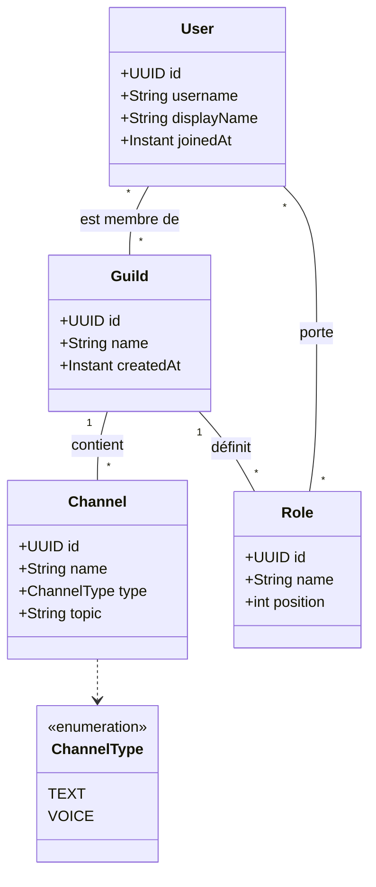

# Modèle du domaine — API Discord (I311)

Modèle minimal des entités `User`, `Guild`, `Role` et `Channel`.

## Diagramme de classes

## Cardinalités

| Relation | Cardinalité | JPA | Traduction en base |
| --- | --- | --- | --- |
| User ↔ Guild | `*..*` | `@ManyToMany` | table d'association `user_guild` |
| Guild → Channel | `1..*` | `@OneToMany` / `@ManyToOne` | clé étrangère `guild_id` dans `channels` |
| Guild → Role | `1..*` | `@OneToMany` / `@ManyToOne` | clé étrangère `guild_id` dans `roles` |
| User ↔ Role | `*..*` | `@ManyToMany` | table d'association `user_role` |

Côté propriétaire des relations `1..*` : l'entité « plusieurs » (`Channel`, `Role`),
qui porte la clé étrangère. Le côté `1` est déclaré avec `mappedBy`.

## Contraintes

Contraintes non exprimables par les seules cardinalités ; elles sont vérifiées
par la couche `application` (service) et couvertes par des tests unitaires.

1. Un `User` ne peut porter un `Role` d'une `Guild` que s'il est membre de cette `Guild`.
2. `User.username` est unique au niveau global.
3. `Role.name` est unique au sein d'une même `Guild`, pas au niveau global.
4. `Channel.name` est unique au sein d'une même `Guild`.
5. Tous les identifiants sont des `UUID` générés par l'application.
6. Les champs `username`, `Guild.name`, `Channel.name` et `Role.name` sont
   obligatoires et non vides.

## Point ouvert

L'appartenance `User ↔ Guild` est aujourd'hui une simple table d'association.
Si le besoin apparaît de porter des données sur l'appartenance elle-même
(date d'arrivée dans le serveur, surnom propre au serveur), cette association
devra devenir une entité à part entière, par exemple `Membership`.
